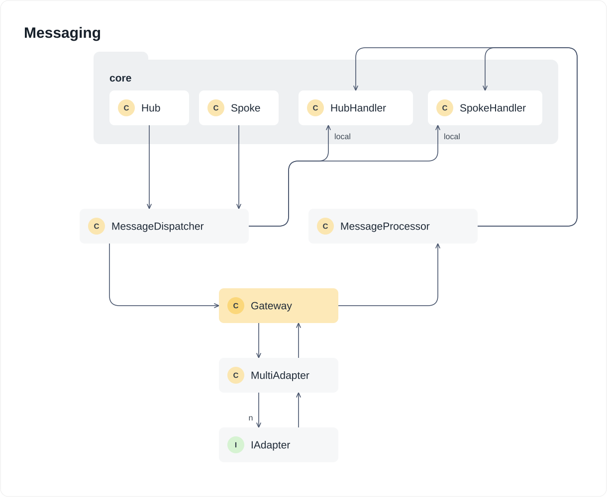

# Messaging

The messaging module handles all cross-chain message serialization, dispatching, and processing in the Centrifuge Protocol. It provides a unified interface for outgoing messages, routes incoming messages to appropriate handlers, batches everything bound for the same destination and pool into a single payload, and settles cross-chain execution fees onchain as part of dispatch. Gas limits and costs are quoted through the `GasService` (`src/admin`) and the configured adapters.

### `MessageDispatcher`

The `MessageDispatcher` serializes and dispatches outgoing cross-chain messages, handling both local and remote destinations. For local destinations (messages sent to the same chain), it directly invokes the appropriate handler to avoid unnecessary cross-chain overhead. For remote destinations, it routes messages through the `Gateway` and `MultiAdapter` to send them via configured cross-chain adapters.

### `MessageProcessor`

The `MessageProcessor` deserializes and processes incoming cross-chain messages, routing them to the appropriate handler based on message type.

The processor extracts the message type and payload from incoming messages using `MessageLib`, then dispatches to the hub handler (`IHubGatewayHandler`) or the spoke handler (`ISpokeGatewayHandler`), plus a root branch for protocol-admin messages, based on the message type. Some types do not go to a handler at all: pool adapter sets are applied on `MultiAdapter`, manager calls are delivered through the `Envoy`, upgrade scheduling and cancellation go to `IScheduleAuth`, and manager updates fan out to the spoke handler, `MultiAdapter`, or `Gateway` depending on the manager kind. An unrecognized type reverts. Authentication of the message source is handled upstream by the `Gateway` and adapters, not by the processor.

### `Gateway`

The `Gateway` is the payment and batching boundary for all messages. Outgoing messages are appended to a transient batch per destination chain and pool while `withBatch` is open, and each batch is sent as a single payload when the batch closes, rejecting a batch whose accumulated gas limit exceeds the destination's maximum. Sending settles the adapter cost from the value provided and refunds the remainder; in unpaid mode an underfunded batch is recorded as `underpaid` instead of reverting, and anyone can settle it later with `repay`.

Incoming batches are split back into individual messages, checking that every message belongs to the same pool and that the source chain matches the one the message requires. Each message is handed to the processor through a gas-capped, excessively-safe call, so a single failing message cannot take down the rest of the batch: it is counted in `failedMessages` and can be re-executed with `retry` or written off with `clearFailedMessage`. All of this is disabled while the protocol is paused.

### `MultiAdapter`

`MultiAdapter` is the adapter set behind the `Gateway`, configured per destination chain and per pool. `setAdapters` installs a new numbered session for a pool, so pending votes from the previous set are never counted against the new one, and requires a threshold no higher than the number of adapters. A session can be taken out of service with `blockSession` and restored with `unblockSession`. Both are callable by a ward or by the pool's adapter manager.

Outgoing payloads are prefixed with the session id and sent over every adapter in the pool's active set, each paid its own estimate and any surplus refunded. Inbound, each adapter votes for the payload it received, and once a payload has votes from `threshold` distinct adapters of that session, those votes are consumed and the payload is forwarded to the `Gateway` exactly once. Voting and execution are separable: `handle` does both, `vote` only records a confirmation, and `execute` forwards a payload whose threshold has already been reached.
