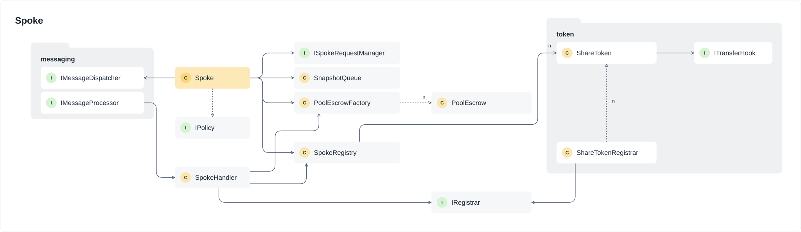
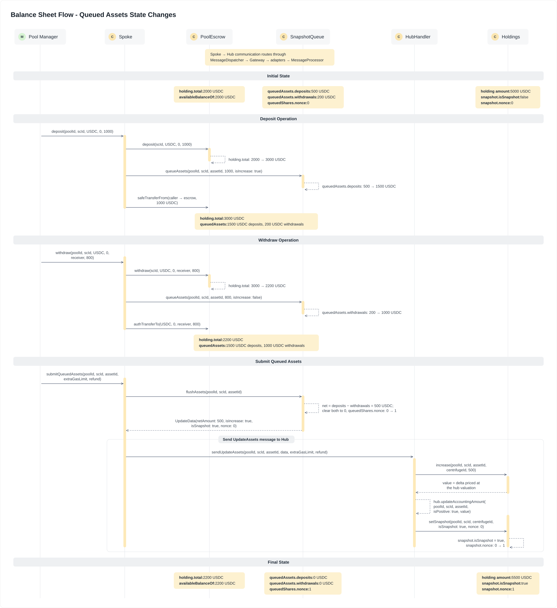

# Spoke

The `Spoke` module manages the local state and operations for pools and share classes on each chain. It handles share token deployment, vault registration, asset tracking, cross-chain transfers, and pool-level balance-sheet management (share issuance/revocation, asset deposits/withdrawals) and escrow operations. This mirrors the Hub architecture: `Spoke` ↔ `Hub`, `SpokeHandler` ↔ `HubHandler`, `SpokeRegistry` ↔ `HubRegistry`, and `SnapshotQueue` ↔ `Holdings`.

### `Spoke`

The `Spoke` contract is the coordination hub for pool operations on a given chain: cross-chain share transfers, asset registration, request forwarding, manager calls, and all balance-sheet operations (share issuance/revocation, asset deposits/withdrawals, reserves, and forced share transfers). It is a `BatchedMulticall`, so operations can be batched into a single cross-chain payload. Pool and share class registration, asset mappings between local addresses and global `AssetId`s, prices, policies, manager roles, and vault state live in `SpokeRegistry`, while inbound cross-chain messages are handled by `SpokeHandler`. It uses its message sender (the `MessageDispatcher`) to communicate state changes to other chains.

The `Spoke` handles asset registration with decimal validation and metadata extraction from ERC20 or ERC6909 tokens. For cross-chain transfers, it checks the share class's `IRegistrar` (`canBridge`) and that the owner holds the pool's `bridger` role, burns the shares locally through that registrar, and dispatches the transfer message to the destination chain. Outbound investment requests are accepted only from the pool's request manager and forwarded to the `Hub`; manager calls are forwarded to the hub chain, where the `Envoy` delivers them to their target. Balance-sheet operations coordinate with `PoolEscrow` for asset custody and queue share and asset deltas in `SnapshotQueue` to reduce cross-chain messaging costs, allowing batched state synchronization with the `Hub`. A single per-pool `manager` role, stored in `SpokeRegistry`, gates every balance-sheet operation, and when the pool has installed a policy those same calls are passed to it for enforcement.

### `SpokeHandler`

`SpokeHandler` processes incoming cross-chain messages from the hub, mirroring `HubHandler` on the other side. It routes pool and share class registration, share metadata and restriction updates, price updates, vault deploy/link/unlink, manager and bridger role changes, policy installation and authorization grants, request manager registration, and request callbacks into `SpokeRegistry` and the share class's `IRegistrar`. All methods are auth-protected and called by the `MessageProcessor`, or directly by the `MessageDispatcher` when hub and spoke share a chain.

Adding a pool also deploys its escrow through `PoolEscrowFactory`. Adding a share class delegates token creation to the `IRegistrar` named in the notification, which owns and operates the share token itself: minting, burning, authorized transfers, metadata, restrictions, and the bridging check all go through it, so the token implementation lives outside `core` (see `src/token`).

### `SnapshotQueue`

The `SnapshotQueue` contract is an `auth`-gated store of the queued share and asset deltas each pool accumulates before they are submitted to the `Hub`, analogous to how `Holdings` backs the `Hub`. `Spoke` is its only caller. Share deltas are netted per share class (issuance adds, revocation subtracts); asset flows are accumulated gross per asset. Flushing consumes a queue and returns the update payload (net amount, snapshot flag, nonce) that `Spoke` sends to the `Hub`, reducing cross-chain messaging costs by batching state synchronization.

The following diagram shows how deposits and withdrawals impact the queue, the pool escrow, and the hub-side holding:

### `PoolEscrow`

`PoolEscrow` provides pool-specific asset custody separated by share class. Each escrow is tied to a single pool and holds assets across multiple share classes, tracking both total holdings and reserved amounts per asset. Reserved amounts enable pending operations like withdrawal requests to lock funds without fully removing them from the pool.

The contract exposes deposit, withdraw, reserve, and unreserve operations, all auth-protected and typically called by the `Spoke`. Reservations are booked per reserver and reason, so one holder of reserved funds cannot release another's. Available balance calculations subtract reserved amounts from totals, ensuring reserved funds cannot be double-spent. The escrow extends the base `Escrow` contract with share class-level accounting and is deployed deterministically per pool by `PoolEscrowFactory`.

### `SpokeRegistry`

`SpokeRegistry` is the on-chain registry for the spoke. It tracks pool and share class registration (each share class pairing a share token with the `IRegistrar` that operates it), asset mappings between local addresses and global `AssetId`s, the per-pool request manager, and prices per share class and asset. It also holds the per-pool `manager` and `bridger` roles, the pool's installed policy, and a consume-only authorization ledger: authorizations arrive already matured from the hub, `authorize` and `unauthorize` add and remove them, and only the installed policy may `consumeAuthorization`. Ids are namespaced by the policy address and its install nonce, so installing a policy makes every outstanding authorization unreachable.

Vault state is tracked as registration, linking, and unlinking. `registerVault` validates that the share class exists and that the asset matches the `AssetId`, then records the vault details (pool, share class, asset, and link status) for reverse lookups from a vault address to its pool context; `linkVault` and `unlinkVault` flip that entry's link status and emit events for state tracking. The registry is called by the `SpokeHandler` when vault updates arrive from the `Hub`, across three update kinds: deploy-and-link (using a factory), link (existing vault), and unlink (remove association). The share token's ERC-7575 vault pointer is maintained by the share class's `IRegistrar`, which validates any pointer against these entries.
